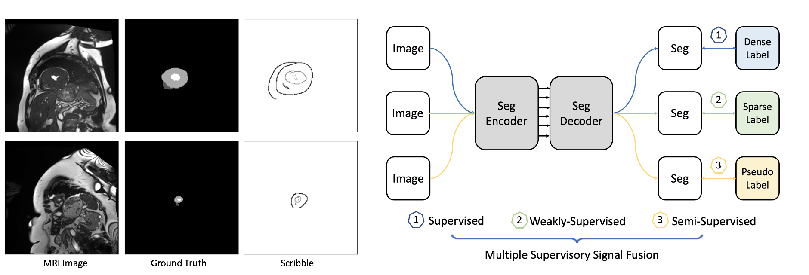

# MixSegNet
MixSegNet: Fusing multiple mixed-supervisory signals with multiple views of networks for mixed-supervised medical image segmentation

## Motivation



Deep learning has driven remarkable advancements in medical image segmentation. However, the requirement for comprehensive annotations poses a significant challenge due to the labor-intensive and expensive nature of expert annotation. Addressing this challenge, we introduce a fused limited-supervised learning strategy, MixSegNet, that synergistically harnesses the benefits of Fully-Supervised (FSL), Weakly-Supervised (WSL), and Semi-Supervised Learning (SSL). This approach enables the utilization of various data-efficient annotations for network training, promoting efficient medical image segmentation within realistic clinical scenarios.

## Requirements
* Pytorch
* Some basic python packages such as Numpy, Scikit-image, SimpleITK, Scipy ......

## DataSets
We use the ACDC dataset which you can find here [Official](https://www.creatis.insa-lyon.fr/Challenge/acdc/databases.html). The pre-processed dataset i.e. scribble is with this GitHub Respository, and you can also simulate the scribble annotations with other dataset with the 'code/scribbles_generator.py' file.


## Usage

1. Clone the repo:
```
git clone https://github.com/ziyangwang007/MixSegNet.git
cd MixSegNet
```


2. Train the model
```
cd code
```

```
python train_FuseSegNet.py 
```

3. Test the model

```
python test_2D_fully.py 
```

For all other baseline methods, please check our work on Semi-Supervised Baseline Methods

CV-SSL-MIS
<br>

and

CV-WSL-MIS
<br>

## Reference

```
@article{wang2024mixsegnet,
  title={MixSegNet: Fusing multiple mixed-supervisory signals with multiple views of networks for mixed-supervised medical image segmentation},
  author={Wang, Ziyang and Yang, Chen},
  journal={Engineering Applications of Artificial Intelligence},
  volume={133},
  pages={108059},
  year={2024},
  publisher={Elsevier}
}
```